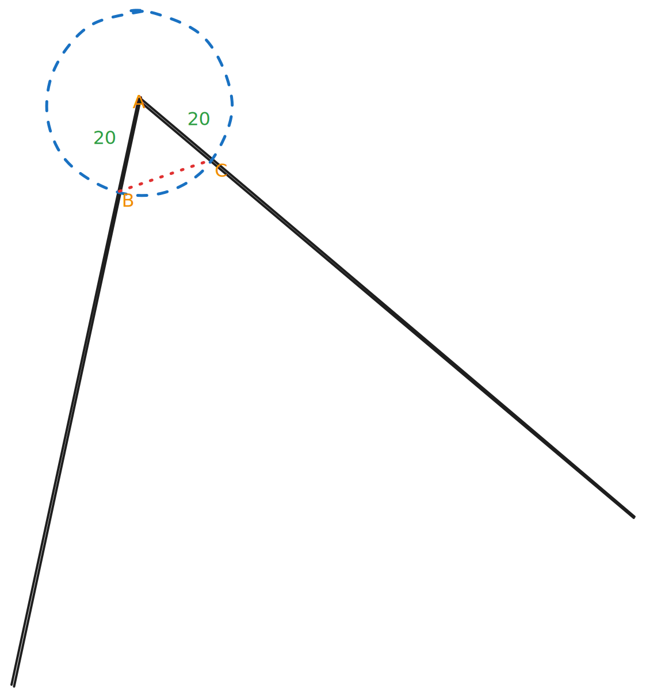

# Triangle Angle Calculator

## Overview
This C++ program calculates the angle opposite to a specified side of a triangle formed by three points in a 2D space. The program can operate in two modes: interactive mode, where users input the coordinates manually, and command-line mode, where coordinates are provided as command-line arguments.

Whilst this program can calculate the angle given of any triangle, it is intended for the game [angle.wtf](https://angle.wtf). It is functional and useful in this instance as the visual representation for the angle is provided through a SVG (scalable vector graphic), which contains the arc to indicate if the angle is a reflex or not. The SVG data provides points for the start and end of that arc, which in combination with the fixed angle center of 150, 100, we can draw a triangle between these points to determine the angle.



## Features
- Calculate the angle opposite to a specified side using the Law of Cosines.
- Validate whether the given points form a triangle using the triangle inequality theorem.
- Support for both interactive and command-line input modes.

## Mathematical Concepts

### Law of Cosines
The Law of Cosines relates the lengths of the sides of a triangle to the cosine of one of its angles. It is expressed as:

$$ c^2 = a^2 + b^2 - 2ab \cdot \cos(C) $$

Where:
- `c` is the length of the side opposite angle ` C `.
-  `a ` and ` b ` are the lengths of the other two sides.

From this formula, we can derive the angle ` C `:

$$ \cos(C) = \frac{a^2 + b^2 - c^2}{2ab} $$

The angle ` C ` can then be calculated using the inverse cosine function:

$$ C = \arccos\left(\frac{a^2 + b^2 - c^2}{2ab}\right) $$

### Triangle Inequality Theorem
The triangle inequality theorem states that for any three sides of a triangle, the sum of the lengths of any two sides must be greater than the length of the third side. This can be expressed as:

$$ AB + AC > BC $$

$$ AB + BC > AC $$

$$ AC + BC > AB $$

If these conditions are not met, the points do not form a triangle, and the program exits.

## Usage

### Compilation
To compile the program, use the following command:

```bash
mkdir build && cd build
cmake ..
make

